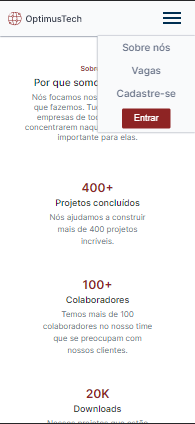

    

 <h1 align="center"> 👨🏽‍💻 Projeto OptimusTech </h1>

 

---

# Guia de estilos

Toda a estilização que foi usada está disponível no projeto dentro do figma.

[Link do projeto no figma](https://lnkd.in/dta7kyrM)

---

## Layout 🚧 

#### Desktop Screenshot

 

 

 

#### Mobile Screenshot

  
---
   
---
  

---

Tecnologias 🚀 

    
<h6>Esse projeto foi desenvolvido com as seguintes tecnologias:</h6>

---

### 📠License 

Copyright © 2021. 

---

### 👤 Autor 

**Daiane da Rosa**

- 
- 

---

[⬆️ Topo](#top)  

