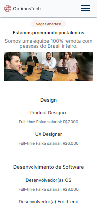

    

 <h1 align="center"> 👨🏽‍💻 Projeto OptimusTech </h1>

---

# Guia de estilos

Toda a estilização que foi usada está disponível no projeto dentro do figma:

---

 Para dar uma olhada no site: 
  
 
 
 
 ---
  

## Layout 🚧 

#### Desktop Screenshot

 

 

 

#### Mobile Screenshot

  
---
   
---
  

---

Tecnologias 🚀 

    
<h6>Esse projeto foi desenvolvido com as seguintes tecnologias:</h6>

---

### 📝 License 

Copyright © 2021. 

---

### 👤 Autor 

 
  
 

---

[⬆️ Topo](#top)  

